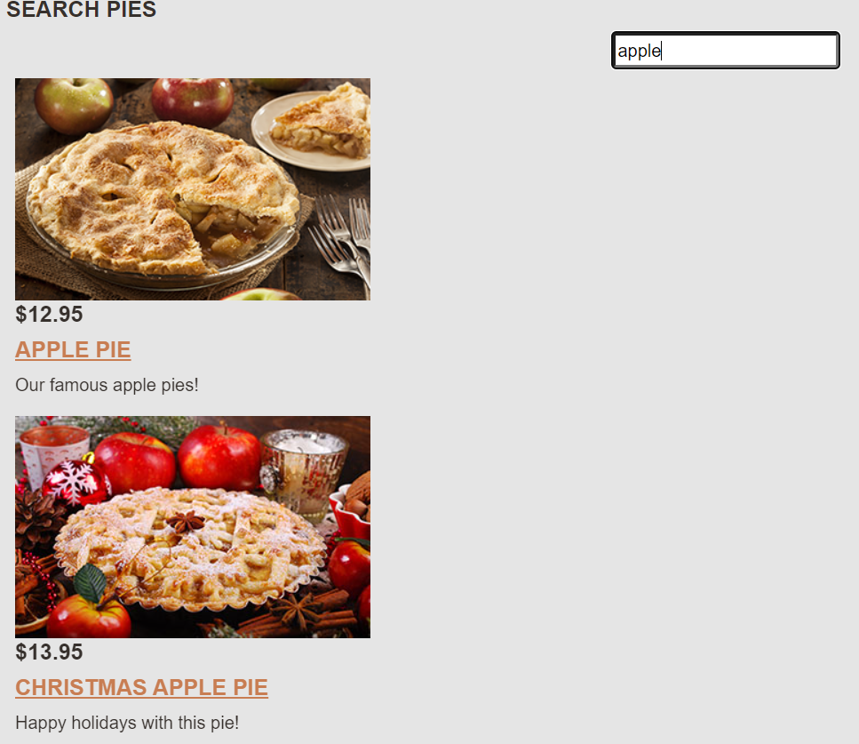
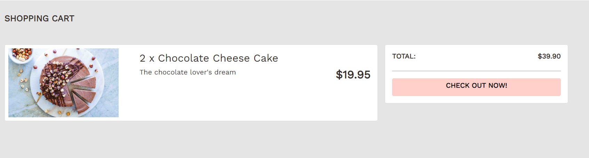

# Bethany's Pie Shop
A full-stack e-commerce web application using ASP.NET Core, allowing users to browse product catalogs and make online purchases. It integrates SQL Server with Entity Framework Core to manage and persist application data efficiently. It also implements a secure authentication and authorization system, enabling role-based access control and protecting user data. The final application was deployed to Azure App Service, ensuring seamless and scalable online availability.

 

 

 

 

 

## Technologies used:

* C#
* ASP.NET Core
* SQL
* Azure
* Razor
* Blazor
* MVC
* OOP
* UI

## Credits:

This is a project I made based on Gill Cleeren's course on [ASP.NET Core Fundamentals](https://app.pluralsight.com/library/courses/asp-dot-net-core-6-fundamentals/transcript).
